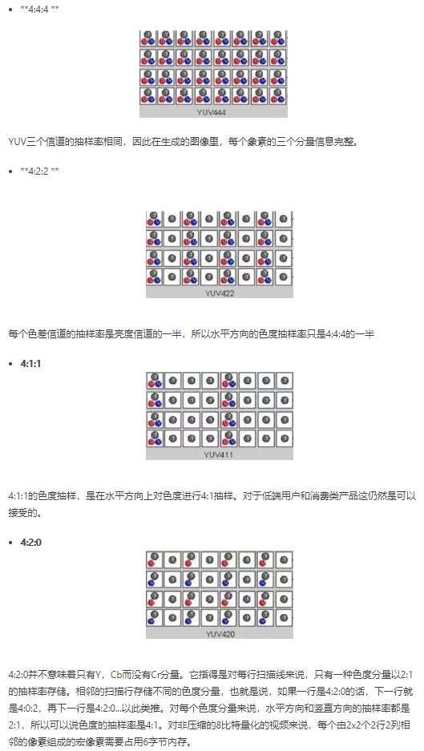
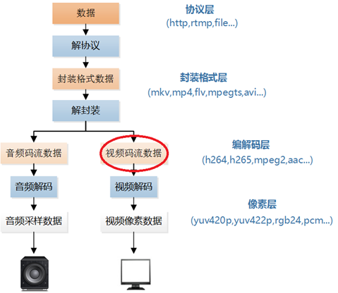

# 音视频基础学习笔记

## 颜色空间
### RGB

RGB色彩模式是工业界的一种颜色标准，是通过对红(R)、绿(G)、蓝(B)三个颜色通道的变化以及它们相互之间的叠加来得到各式各样的颜色的，RGB即是代表红、绿、蓝三个通道的颜色，这个标准几乎包括了人类视力所能感知的所有颜色，是目前运用最广的颜色系统之一    

RGB格式   

|格式|说明|
|-|-|
|RGB1|每个像素用1位表示，2种色彩 2^1|
|RGB4|每个像素用4位表示，16种颜色 2^4|
|RGB8|每个像素用8位表示，256种颜色 2^8|
|RGB555(RGB16)|每个像素用16位表示，RGB分量都用5位表示（剩下的1位不用），XRRRRRGGGGGBBBBB（X表示不用，可以忽略）|
|RGB565|每个像素用16位表示，5位用于R，6位用于G，5位用于B，RRRRRGGGGGGBBBBB|
|RGB24|每个像素用24位表示，RGB分量都用8位表示，取值范围为0-255。注意在内存中RGB各分量的排列顺序为：BGR BGR BGR…。通常可以使用RGBTRIPLE数据结构来操作一个像素|
|RGB32|每个像素用32位表示，RGB分量都用8位表示（剩余8位不用），（ARGB32就是带Alpha通道的RGB24。）注意在内存中RGB各分量的排列顺序为：BGRA BGRA BGRA…。通常可以使用RGBQUAD数据结构来操作一个像素|
|ARGB32|每个像素用32位表示，RGB分量都用8位表示（剩余8位用于Alpha通道）|

更通俗的讲，2位颜色的图，每个存储1个像素一般可存放2位二进制。也就是2个01进行排列组合，排列组合的结果有2的2次幂=4种颜色。我们把每个像素可表示颜色的2的幂指数称为深度。

### YUV

YUV是一种颜色编码方法。常使用在各个视频处理组件中。 YUV在对照片或视频编码时，考虑到人类的感知能力，允许降低色度的带宽，把亮度与色度分离，根据人对亮度更敏感些，增加亮度的信号，减少颜色的信号，以这样“欺骗”人的眼睛的手段来节省空间，从而适合于图像处理领域。   
YUV是编译true-color颜色空间（color space）的种类，Y'UV, YUV, YCbCr，YPbPr等专有名词都可以称为YUV，彼此有重叠。“Y”表示明亮度（Luminance或Luma），也就是灰阶值，“U”和“V”表示的则是色度（Chrominance或Chroma），作用是描述影像色彩及饱和度，用于指定像素的颜色

YCbCr模型来源于YUV模型，算是YUV的压缩版本，不同之处在于Y'CbCr用于数字图像领域，YUV用于模拟信号领域，MPEG、DVD、摄像机中常说的YUV其实是Y'CbCr。

其中Y与YUV 中的Y含义一致，Cb , Cr 同样都指色彩,，只是在表示方法上不同而已，Cb Cr 就是本来理论上的“分量/色差”的标识。C代表分量(是component的缩写)Cr、Cb分别对应r(红)、b(蓝)分量信号，Y除了g(绿)分量信号，还叠加了亮度信号。

在YUV 家族中, YCbCr 是在计算机系统中应用最多的成员, 其应用领域很广泛,JPEG、MPEG均采用此格式。一般人们所讲的YUV大多是指YCbCr

#### YUV格式

为节省带宽起见，大多数YUV格式平均使用的每像素位数都少于24位。主要的抽样（subsample）格式有YCbCr4:2:0、YCbCr4:2:2、YCbCr4:1:1和YCbCr4:4:4。YUV的表示法称为A:B:C表示法：
- 4:4:4表示完全取样。
- 4:2:2表示2:1的水平取样，垂直完全采样。
- 4:2:0表示2:1的水平取样，垂直2：1采样。
- 4:1:1表示4:1的水平取样，垂直完全采样。

### 颜色空间的转换

不同颜色可以通过一定的数学关系相互转换：   
RGB转YUV：   
> Y = (0.257 * R) + (0.504 * G) + (0.098 * B) + 16   
> Cr = V = (0.439 * R) - (0.368 * G) - (0.071 * B) + 128   
> Cb = U = -( 0.148 * R) - (0.291 * G) + (0.439 * B) + 128

YUV转RGB：   
> B = 1.164(Y - 16) + 2.018(U - 128)   
> G = 1.164(Y - 16) - 0.813(V - 128) - 0.391(U - 128)   
> R = 1.164(Y - 16) + 1.596(V - 128)   

## 视频相关术语

### 帧(Frame)：
是影像中常用的最小单位，相当于电影中胶片的每一格镜头，一帧就是一副静止的画面，连续的帧就形成了视频。

### 帧速率(FPS)：
每秒钟所传输图片的个数，也可以理解为处理器每秒刷新的次数，通常用FPS标识，当然帧数越高，画面也就越流畅。

### 视频编码：

视频编码也就是文件当中的视频所采用的压缩算法，视频编码的主要作用是将视频像素数据（RGB，YUV等）压缩成为视频码流，从而降低视频的数据量。

### 视频解码：

有了编码，当然也需要有解码。
因为压缩（编码）过的内容无法直接使用，使用（观看）时必须解压缩，还原为原始的信号（比如视频中某个点的颜色等），这就是“解码“或者”解压缩“。

### 采样频率：
采样频率，也称为采样速度或者采样率，定义了每秒从连续信号中提取并组成离散信号的采样个数，它用赫兹（Hz）来表示。采样频率的倒数是采样周期或者叫作采样时间，它是采样之间的时间间隔。通俗的讲采样频率是指计算机每秒钟采集多少个信号样本。

### 比特率(码率)：
表示单位时间(1秒)内传送的比特数，一般我们用的单位是kbps，其英文是 Kilobits per second，意即“千位每秒”（根据发音亦译作“千比特每秒”），意思是说每过一秒钟，有多少千比特的数据流过，因此码率也经常被称为“比特率”。

#### --- 音频中 码率：
就是音频文件或者音频流中1秒中的数据量，如1.44Mbps，就是1秒钟内的数据量1.44Mbits 。 码率越高，传送的数据越大，音质越好，
声音比特率 = 采样率（Hz） x 采样位数（bit） x 声道数.

#### --- 视频中 码率：
原理与声音中的相同，都是指由模拟信号转换为数字信号后，单位时间内的二进制数据量，通俗来讲就是把每秒显示的图片进行压缩后的数据量。
视频比特率（位/秒）= (画面尺寸彩色位数（bit）帧数)**

> 假设有一张标准音乐CD光盘容量是746.93MB（注意大B是字节，小b是位。一字节（B）等于8位（b）。）

> CD音频是以采样率为44.1KHZ，采样位数为16位，左右双声道（立体声）进行采样的。而一张标准CD光盘的时长是74分钟。

> 那么容量计算公式为：比特率=(44100 x 16 x 2)Kbps，转为KBps (44100 x 16 x 2)/8(KBps)
74分钟的话 就是(44100 x 16 x 2)/8x(74 x 60)=783216000字节 转为MB为 783216000/1024/1024=746.93MB(兆字节)

#### 计算机中的应用
比特率是指每秒传送的比特（bit）数。单位为bps(Bit Per Second），比特率越高，传送的数据越大。比特率表示经过编码（压缩）后的音、视频数据每秒钟需要用多少个比特来表示，而比特就是二进制里面最小的单位，要么是0，要么是1。比特率与音、视频压缩的关系，简单的说就是比特率越高，音、视频的质量就越好，但编码后的文件就越大；如果比特率越少则情况刚好相反。   

计算机中的信息都是二进制的0和1来表示，其中每一个0或1被称作一个位，用小写b表示，即bit（位）；大写B表示byte，即字节，一个字节=八个位，即1B=8b；前面的大写K表示千的意思，即千个位（Kb)或千个字节（KB）。表示文件的大小单位，一般都使用字节（KB）来表示文件的大小。   

Kbps：首先要了解的是，ps指的是/s，即每秒。Kbps指的是网络速度，也就是每秒钟传送多少个千位的信息（K表示千位，Kb表示的是多少千个位），为了在直观上显得网络的传输速度较快，一般公司都使用kb（千位）来表示，如果是KBps，则表示每秒传送多少千字节。1KBps=8Kbps。ADSL上网时的网速是512Kbps，如果转换成字节，就是512/8=64KBps（即64千字节每秒）。

## 主要流媒体协议

| 名称   | 推出机构       | 传输层协议     | 客户端| 使用领域|
| - | - | -|-|-|
|RTSP+RTP|IETF|TCP+UDP|VLC, WMP|IPTV|
|RTMP|Adobe Inc.|TCP|Flash|互联网直播|
|RTMFP|Adobe Inc.|UDP|Flash|互联网直播|
|MMS|Microsoft Inc.|TCP/UDP|WMP|互联网直播+点播|
|HTTP|WWW+IETF|TCP|Flash|互联网点播|

## 主要封装格式

|名称|推出机构|流媒体|支持的视频编码|支持的音频编码|目前使用领域|
|-|-|-|-|-|-|
|AVI|Microsoft Inc.|不支持|几乎所有格式|几乎所有格式|BT下载影视|
|MP4|MPEG|支持|MPEG-2, MPEG-4, H.264, H.263等|AAC, MPEG-1 Layers I, II, III, AC-3等|互联网视频网站|
|TS|MPEG|支持|MPEG-1, MPEG-2, MPEG-4, H.264|MPEG-1 Layers I, II, III, AAC,|IPTV，数字电视|
|FLV|Adobe Inc.|支持|Sorenson, VP6, H.264|MP3, ADPCM, Linear PCM, AAC等|互联网视频网站|
|MKV|CoreCodec Inc.|支持|几乎所有格式|几乎所有格式|互联网视频网站|
|RMVB|Real Networks Inc.|支持|RealVideo 8, 9, 10|AAC, Cook Codec, RealAudio Lossless|BT下载影视|

## 主要视频编码

视频编码的主要作用是将视频像素数据（RGB，YUV等）压缩成为视频码流，从而降低视频的数据量
- 与H.264相比H.265的最大本领是可以在维持画质基本不变的前提下，让数据传输带宽减少至H.264的一半。同时其还支持最高为7680*4320的分辨率，因此即使是2160P甚至是更高级别的超高清视频同样可以通过H.265格式进行编码。

- 下一代的编解码标准就要数H.265和VP9。VP9是Google继VP8之后推出的新一代标准。VP9和HEVC相比，要稍微逊色一些

- 在码率一定的情况下，几种编码标准的比较结果大致为：H.265 > VP9 > H.264> VP8 > MPEG4 > H.263 > MPEG2。

|名称(标准)|推出机构|推出时间|目前使用领域|
|-|-|-|-|
|H.265(HEVC)|MPEG/ITU-T|2013|各个领域|
|H.264|MPEG/ITU-T|2003|各个领域|
|MPEG4|MPEG|2001|不温不火|
|MPEG2|MPEG|1994|数字电视|
|VP9|Google|2013|youtub，chrome等|
|VP8|Google|2008|不普及|
|VC-1|Microsoft Inc.|2006|微软平台|

## 主要音频编码

音频编码主要是将音频采样数据（PCM）压缩成音频码流，从而降低音频的数据量。   

|名称(标准)|推出机构|推出时间|目前使用领域|
|-|-|-|-|
|AAC|MPEG|1997|各个领域（新）|
|AC-3|Dolby Inc.|1992|电影|
|MP3|MPEG|1993|各个领域（旧）|
|WMA|Microsoft Inc.|1999|微软平台|

## 播放一个网络视频的步骤

视频播放器播放一个互联网上的视频文件，需要经过以下几个步骤：解协议，解封装，解码音视频，音视频同步。如果播放本地文件则不需要解协议，为以下几个步骤：解封装，解码音视频，音视频同步。他们的过程如图所示。

### 解协议

就是将流媒体协议的数据，解析为标准的相应的封装格式数据。音视频在网络上传播的时候，常常采用各种流媒体协议，例如HTTP，RTMP，或是MMS等等。这些协议在传输音视频数据的同时，也会传输一些信令数据。这些信令数据包括对播放的控制（播放，暂停，停止），或者对网络状态的描述等。解协议的过程中会去除掉信令数据而只保留音视频数据。例如，采用RTMP协议传输的数据，经过解协议操作后，输出FLV格式的数据。

### 解封装

就是将输入的封装格式的数据，分离成为音频流压缩编码数据和视频流压缩编码数据。封装格式种类很多，例如MP4，MKV，RMVB，TS，FLV，AVI等等，它的作用就是将已经压缩编码的视频数据和音频数据按照一定的格式放到一起。例如，FLV格式的数据，经过解封装操作后，输出H.264编码的视频码流和AAC编码的音频码流。

### 解码

就是将视频/音频压缩编码数据，解码成为非压缩的视频/音频原始数据。音频的压缩编码标准包含AAC，MP3，AC-3等等，视频的压缩编码标准则包含H.264，MPEG2，VC-1等等。解码是整个系统中最重要也是最复杂的一个环节。通过解码，压缩编码的视频数据输出成为非压缩的颜色数据，例如YUV420P，RGB等等；压缩编码的音频数据输出成为非压缩的音频抽样数据，例如PCM数据。

### 音视频同步

就是根据解封装模块处理过程中获取到的参数信息，同步解码出来的视频和音频数据，并将视频音频数据送至系统的显卡和声卡播放出来

